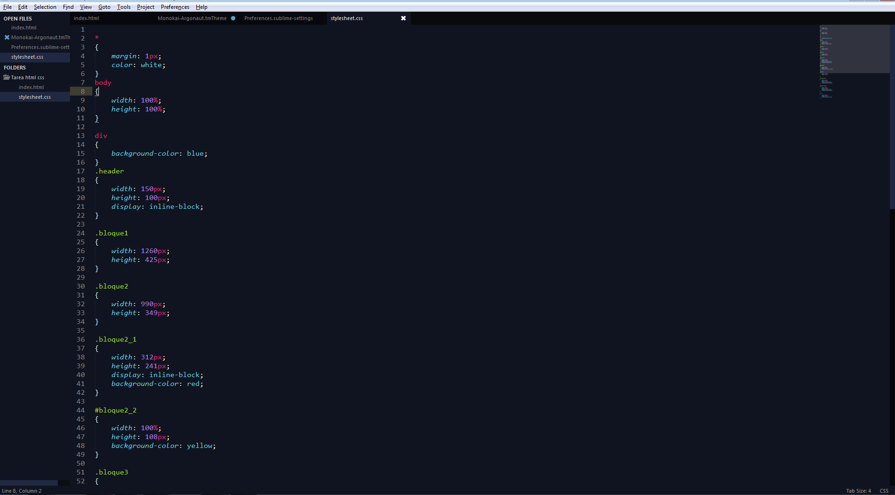

Sublime-Monokai-Argonaut
========================

A simple color scheme based on monokai but with argononaut background color

<h1>Getting started</>

<h2>1.- Installation</>

Go to  Preferences -> Browse Packages, and download the scheme in  "Theme - Argonaut" directory 

<h2>2.- Switch Scheme</>

Go to Preferences -> Color Scheme/Theme - Argonaut/Monokai-Argonaut

